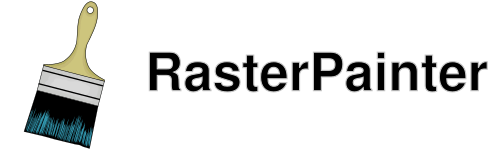

# RasterPainter

	

### Raster Graphics for Dungeondraft
RasterPainter is a mod for Dungeondraft that implements basic raster graphics capabilities in the form of a simple layer based editor.

### Features
- Import external files into your map (WebP, PNG and JPEG supported)
- Export raster layers to image files for editing (Export formats: WebP, PNG and JPEG)
- Use your light assets as brushes
- Full Undo and Redo Support (Requires [_Lib](https://cartographyassets.com/assets/31828/_lib/))
- Draw and blend terrain seamlessly
- Layer opacity and tinting
- Layers persist even if map is loaded without the mod (they won't be visible though)

### Installation
Download the zip of the repo from [here](https://codeload.github.com/MicroTransactionsMatterToo/RasterPainter/zip/refs/heads/main) or using the green Code button, and unzip it into your mod directory
Then install [_Lib](https://cartographyassets.com/assets/31828/_lib/)

#### IMPORTANT!
Due to limitations of Dungeondrafts modding API, layers are stored in your `.dungeondraft_map` file, **which will increase file sizes, save and load times**, sometimes quite significantly. This can be mitigated to an extent by modifying the *Render Scale* in settings **(requires _Lib to be installed)**. I'd also recommend only using the mod primarily to make finishing touches, rather than to build your entire map.

Also, please make a backup of your map file while using the mod! I've done my best to avoid crashes, but I can't make guarantees

This mod can be quite heavy on RAM, especially at lower render scales, so be aware of this if you edit primarily on a laptop.

#### FAQ
- Q: Painting is slow and freezes up Dungeondraft for a bit after every stroke
  A: Unfortunately this is something I can't completely resolve. To improve responsiveness, lower your render scale in settings
- Q: The ends of lines drawn using a brush have a line running through them
  A: Unfortunately this isn't resolveable at present, but if it's really bugging you and you have a very good computer and a lot of RAM, you can set your render scale to 1
- Q: Drawing on a large map is blurry and pixelated
  A: Due to engine limitations, raster layers cannot have a resolution greater than 16384 x 16384. To avoid a confusing crash, RasterPainter will automatically reduce the render scale until the raster layer will fit into this limitation
- Q: I tried using a custom assets as a brush, but the stroke is broken
  A: Not all light textures are suitable for use as brushes, particularly those that have a lot of empty space.
- Q: I can't undo or redo strokes!
  A: Full Redo and Undo functionality, along with the configuration menu, require _Lib to be installed to function
- Q: I've run into a crash or bug!
  A: If you're running into crashes or other bugs, please file an issue on the Github repository.

#### Donations
If this mod has been useful to you, feel free to drop me 5 bucks on my Ko-Fi. It's much appreciated